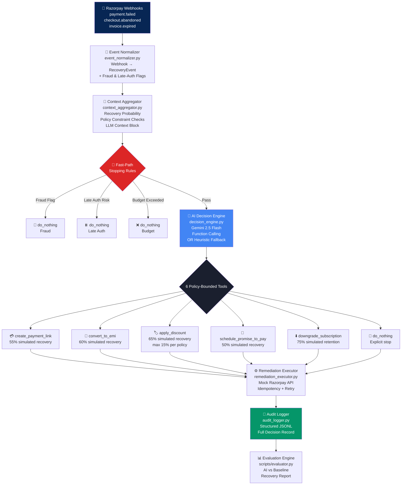
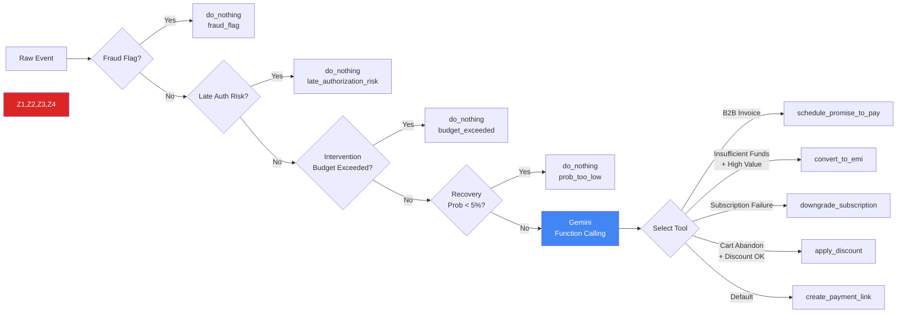

<div align="center">

<h1>⚡ remediate</h1>

<p><strong>AI-Powered Financial Remediation Engine</strong><br/>
<em>Policy-bounded LLM agent that recovers failed payments through negotiation, not just retries.</em></p>

<p>
  <a href="https://python.org"></a>
  <a href="https://ai.google.dev/gemini-api"></a>
  <a href="LICENSE"></a>
  <a href="https://razorpay.com"></a>
</p>

<p>
  <a href="https://twitter.com/Razorpay">Follow @Razorpay</a> ·
  <a href="https://twitter.com/RazorpayDevs">@RazorpayDevs</a> ·
  <strong>#RazorpayBuildathon #Track03 #AIRevenueRecovery</strong>
</p>

---

</div>

## 🎯 What Is This?

**remediate** is a **Policy-Bounded Conversational Financial Concierge** — an LLM agent that recovers high-value, complex payment failures that standard retry-and-notify systems **cannot handle**.

It doesn't compete with Razorpay's Smart Retries or Agent Studio. It specialises in cases where the root cause is **financial friction** — cash flow issues, sticker shock, B2B billing delays — requiring **negotiation and restructuring**, not just another payment link blast.

> Built for **Razorpay AI Buildathon 2026 — Track 03: AI Revenue Recovery**

---

## 🏗️ System Architecture



---

## 🔥 Key Capabilities

| Capability | How It Works | Razorpay API Used |
|---|---|---|
| **Dynamic EMI Conversion** | Restructures high-value failures into 2–6 monthly instalments | Payment Links (series) |
| **Promise-to-Pay Tracker** | Parses natural language date, pauses retries, schedules link delivery | Notifications + Scheduler |
| **Anti-Churn Downgrades** | Switches subscription to lower tier or temporary pause | Subscriptions API |
| **Smart Discounts** | Bounded by `max_discount_pct: 15%` — cooldown enforced | Payment Links |
| **Fraud Hard Stop** | `card_stolen` / `customer_fraud_risk` → immediate do_nothing | None (policy override) |
| **Late-Auth Safety** | Razorpay timeout → hold, no duplicate link created | None (wait) |
| **Intervention Budget** | Customer with ≥3 interventions in 30 days → auto-skip | Policy enforcement |

---

## 📊 Real Batch Results

> The following metrics are from an actual run of **500 synthetic revenue-at-risk events**. No fake data.

### Executive Summary

| Metric | Baseline (Naive Retry) | **remediate (AI Engine)** | Lift |
|--------|----------------------|--------------------------|------|
| Events Processed | 500 | 500 | — |
| Revenue at Risk (Rs) | 2,21,72,623 | 2,21,72,623 | — |
| Revenue Recovered (Rs) | 88,69,049 | **92,71,323** | **+Rs 4,02,274** |
| Recovery Rate | 40.0% | **41.8%** | **+1.8 pp** |
| Brand Damage Cost (Rs) | 1,215 | **0** | Eliminated |
| Fraud Events Stopped | 0 / 59 | **59 / 59** | **100%** |
| Late-Auth Double-Charges | 22 sent | **0 sent** | Prevented |
| Do-Nothing Decisions | 0 | **99** | Policy-compliant |
| **Net Recovery Lift** | — | — | **+4.6%** |
| Processing Time | — | **4.6 seconds** | — |

### Tool Distribution

| Tool | Events | Revenue Recovered (Rs) | Avg / Event (Rs) |
|------|--------|----------------------|-----------------|
| `create_payment_link` | 278 | 55,09,364 | 19,818 |
| `do_nothing` | 99 | 0 | 0 |
| `convert_to_emi` | 79 | 19,88,968 | 25,177 |
| `schedule_promise_to_pay` | 30 | 17,55,000 | 58,500 |
| `apply_discount` | 14 | 17,991 | 1,285 |

### Recovery by Failure Reason

| Failure Reason | Events | Recovery Rate |
|---|---|---|
| `do_not_honor` | 41 | **77.1%** |
| `card_expired` | 36 | **61.8%** |
| `cart_abandoned` | 28 | **60.9%** |
| `invoice_overdue_b2b` | 18 | **53.8%** |
| `invoice_overdue_b2b_long` | 15 | **50.0%** |
| `invalid_otp` | 89 | 50.6% |
| `insufficient_funds` | 75 | 42.9% |
| `subscription_renewal_failed` | 62 | 43.7% |
| `card_stolen` | 39 | **0.0%** ✓ *(fraud halted)* |
| `timeout` | 22 | **0.0%** ✓ *(late-auth held)* |

---

## 📁 Project Structure

```
remediate/
├── batch_runner.py          # 🚀 Entry point — run this
│
├── config/
│   └── merchant_policy.json # 📋 All AI bounds defined here
│
├── engine/                  # 🧠 Core package
│   ├── __init__.py
│   ├── event_normalizer.py  # Webhook → RecoveryEvent
│   ├── context_aggregator.py# Enrichment + policy pre-check
│   ├── decision_engine.py   # Gemini function calling + fallback
│   ├── razorpay_mock.py     # Mock Razorpay API layer
│   ├── remediation_executor.py # Tool execution + idempotency
│   ├── orchestrator.py      # Pipeline connector
│   └── audit_logger.py      # Structured JSONL audit trail
│
├── scripts/
│   ├── generate_events.py   # Generates 500 synthetic events
│   └── evaluator.py         # AI vs baseline comparison
│
├── dashboard/
│   ├── index.html           # Live results dashboard
│   └── server.py            # HTTP server (localhost:8080)
│
├── data/                    # Generated (not committed)
│   └── synthetic_events.jsonl
│
└── outputs/                 # Generated (not committed)
    ├── audit_log.jsonl
    ├── batch_outcomes.jsonl
    └── evaluation_report.md
```

---

## 🛡️ Merchant Policy Schema

All AI decisions are **strictly bounded** by `config/merchant_policy.json`. The LLM cannot exceed these limits:

```json
{
  "discount_policy":       { "max_discount_pct": 15, "discount_cooldown_days": 90 },
  "emi_policy":            { "allow_emi_conversion": true, "max_emi_months": 6, "min_order_value_inr": 3000 },
  "promise_to_pay_policy": { "max_deferral_days": 30, "max_promise_attempts_per_invoice": 2 },
  "intervention_budget":   { "max_interventions_per_customer_per_30d": 3 },
  "stopping_rules":        { "stop_on_recovery_probability_below_pct": 5 },
  "human_escalation":      { "escalate_on_amount_above_inr": 50000, "escalate_on_b2b_invoice_overdue_days": 14 }
}
```

---

## 🚀 Quick Start

### 1. Clone & Setup Environment

```bash
git clone https://github.com/x2ankit/remediate.git
cd remediate

# Create conda environment (Python 3.11)
conda create -n remediate python=3.11 -y
conda activate remediate

# Install dependencies
pip install -r requirements.txt
```

### 2. Generate Synthetic Events

```bash
python scripts/generate_events.py
# Output: data/synthetic_events.jsonl (500 events)
```

### 3. Run the Batch (Heuristic Mode — no API key needed)

```bash
python batch_runner.py
```

### 4. Run with Live Gemini AI

```bash
# Windows (PowerShell)
$env:GEMINI_API_KEY = "your-api-key-here"
python batch_runner.py
```

### 5. Generate Evaluation Report

```bash
python scripts/evaluator.py
# Output: outputs/evaluation_report.md
```

### 6. Launch Live Dashboard

```bash
python dashboard/server.py
# Open: http://localhost:8080
```

---

## 🔬 Decision Flow — How the AI Chooses



---

## ⚡ Why This Beats Simple Retry

| Problem with Naive Retry | How remediate Solves It |
|---|---|
| Blasts fraud victims with payment links | Hard stop on `card_stolen` / `customer_fraud_risk` |
| Creates duplicate links after Razorpay timeout | Late-auth detection → do_nothing |
| Annoying customers who already said "I'll pay Friday" | Promise-to-Pay tracker pauses all retries |
| Rs 30,000 invoice fails → send Rs 30,000 link | Splits into 3x Rs 10,000 EMI links |
| Repeats discounts to same customer every week | 90-day discount cooldown enforced |
| No audit trail | Full JSONL record: reason → decision → outcome |

---

## 🧪 Running Tests

```bash
# Verify the engine imports correctly
python -c "from engine.event_normalizer import normalize; print('OK')"

# Run a single event through the pipeline
python -c "
import json, sys
sys.path.insert(0, '.')
from engine.event_normalizer import normalize
from engine.context_aggregator import enrich
with open('config/merchant_policy.json') as f:
    policy = json.load(f)
raw = {'event_id': 'test_001', 'event_index': 0, 'event_type': 'payment.failed',
       'timestamp': '2026-08-26T12:00:00Z', 'merchant_id': 'DEMO',
       'customer': {'id': 'c1', 'name': 'Test User', 'email': 'test@example.com',
                    'phone': '+919999999999', 'is_b2b': False,
                    'previous_interventions_30d': 0, 'previous_successful_payments': 5,
                    'last_discount_days_ago': None},
       'payment': {'payment_id': 'p1', 'order_id': 'o1', 'amount_inr': 29999,
                   'currency': 'INR', 'method': 'card', 'product_name': 'Pro Plan',
                   'product_type': 'subscription'},
       'error': {'code': 'BAD_REQUEST_ERROR', 'source': 'issuer',
                 'step': 'payment_authorization', 'reason': 'insufficient_funds',
                 'description': 'Insufficient balance'}}
event = normalize(raw)
ctx = enrich(event, policy)
print('Priority:', ctx.recovery_priority)
print('Probability:', ctx.estimated_recovery_probability_pct)
print('Strategies:', ctx.suggested_strategies)
"
```

---

## 📦 Dependencies

| Package | Version | Purpose |
|---|---|---|
| `google-generativeai` | ≥ 0.8.0 | Gemini function calling (optional) |
| `python-dateutil` | ≥ 2.9.0 | Date parsing for Promise-to-Pay |

> **No API key needed** — the engine runs in heuristic mode with zero external dependencies.

---

## 🤝 Contributing

This project was built for the **Razorpay AI Buildathon 2026**. PRs, issues, and forks are welcome.

---

<div align="center">

**Built with ❤️ for [@Razorpay](https://twitter.com/Razorpay) · [@RazorpayDevs](https://twitter.com/RazorpayDevs)**

`#RazorpayBuildathon` `#Track03` `#AIRevenueRecovery` `#FinTech` `#GenerativeAI`

</div>
